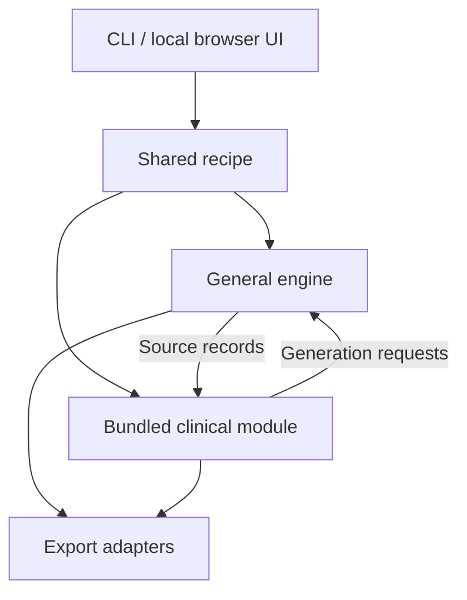

# Ravel

**Compose the data you need.**

Synthetic test data from examples, assumptions and explicit rules.

Testing data workflows requires cases with known expected outcomes. Ravel is a project for developers, testers and
analysts who need reproducible synthetic datasets, starting with clinical and
biomedical scenarios and a general-purpose generation engine underneath.

**Early development preview:** The accepted fictional baseline/change specification and working
progress-dashboard tooling exist. Clinical data generation and the application
CLI/UI are not implemented. The reference expectations below are part of the
specification; they are not generated application results or evidence of
independent clinical validation or standards conformity.

[Clinical specification](docs/baseline-specification.md) ·
[Recipe architecture](docs/specification.md) ·
[Product plan](docs/plan.md)

## Reference cases

Within each declared subject/parameter pair, select the last nonmissing
measurement **strictly before the first actual dose** as baseline. Change is
follow-up value minus baseline, for measurements **strictly after dose** in the
same group and compatible units. At-dose measurements receive
`AT_DOSE_BOUNDARY` diagnostics and **no change row**.

These four accepted, invented cases are specification reference expectations.
Values use the fictional unit `bx-unit`; `null` means a missing result.

| Case | Situation | Expected baseline | Expected change |
| --- | --- | --- | --- |
| 1 | Ordinary baseline | 10 | +3 |
| 2 | Latest pre-dose value missing | 8 | +3 |
| 3 | At-dose boundary without an earlier eligible value | `null` | `null` |
| 4 | At-dose boundary with an earlier eligible value | 10 | +5 |

Case 4 uses pre-dose **10**, at-dose **12**, and post-dose **15**. Its expected
baseline is **10** and post-dose change is **15 - 10 = +5**. The at-dose record
receives diagnostics and no change row.

Case 3 reports `NO_ELIGIBLE_BASELINE`. In Cases 3 and 4, the change shown is for
the post-dose measurement; the at-dose record has no change row. See the
[complete inputs, source IDs, diagnostics and expected outputs](docs/baseline-specification.md)
for the accepted validation contracts, missing-result handling and error rules.
These are fictional study rules, not universal clinical conventions.

## Planned capabilities

- Generate linked subjects, exposures and biomarker measurements from explicit
  recipes and clinical rules.
- Profile an invented sample, edit its assumptions, and generate new records
  or retain and extend the sample with row origin recorded.
- Export CSV datasets with a JSON recipe, data dictionary and validation report.
- Run offline through a CLI and a local browser UI with Guided and Advanced
  views of the same recipe; Windows, Linux and macOS are intended targets.

Planned reproducibility checks use the same **recipe, input, seed, application
version and pinned environment**. Cross-platform comparisons require declared
numeric tolerances; arbitrary byte equality across environments is not promised.
Numeric policies and implementation remain future work.

**Planned architecture (not implemented):**

The engine owns generic generation and structural constraints. The clinical
module owns clinical meaning and derivations; thin interfaces and export
adapters collect settings and present or serialize results.

## Development and license

See the [development guide](docs/development.md) for dashboard usage, local
checks and maintenance, and [decisions](docs/decisions.md) for agreed direction
and unresolved choices.

Development, including code and documentation, is AI-assisted. The maintainer
reviews and accepts changes; AI assistance does not establish clinical correctness.

Licensed under the [MIT License](LICENSE). Copyright 2026 Maksim Sendetski.
