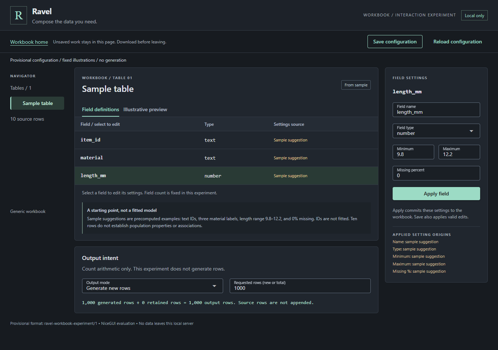
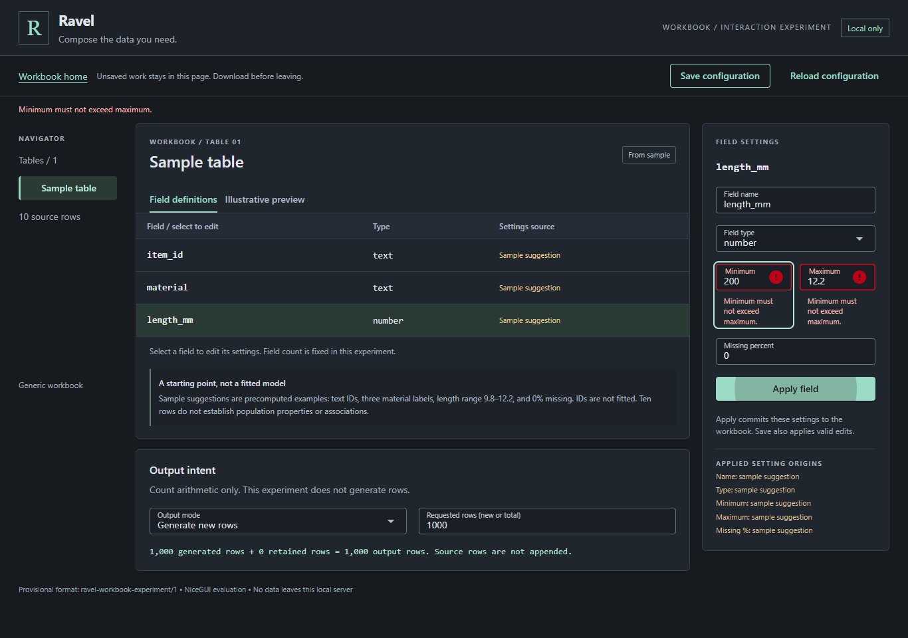
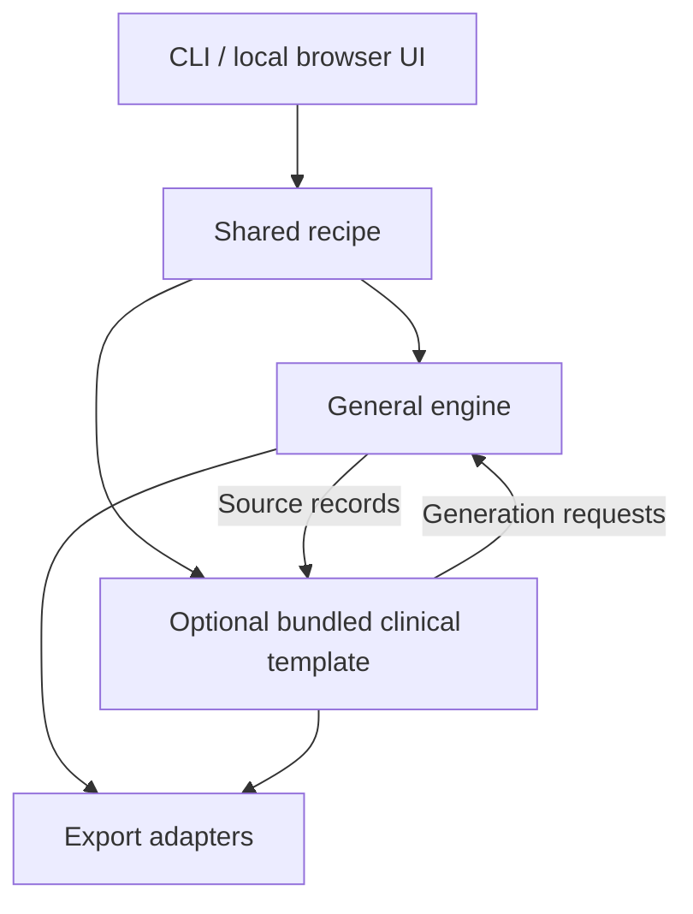

# Ravel

**Compose the data you need.**

Synthetic test data from examples, assumptions and explicit rules.

Testing data workflows requires cases with known expected outcomes. Ravel is a project for developers, testers and
analysts who need reproducible synthetic datasets from explicit rules or an
imported sample. Both workflows will edit the same recipe. Clinical scenarios
will be an optional domain template on a general-purpose engine.

**Early development preview:** A runnable, fixture-based NiceGUI workbook
prototype, progress-dashboard tooling and the accepted fictional baseline/change
specification exist. Real profiling, data generation, clinical derivation and a
production application are not implemented. NiceGUI remains an evaluation
candidate. The clinical reference expectations below are specification examples,
not generated results or evidence of independent clinical validation or standards
conformity.

[Clinical specification](docs/baseline-specification.md) ·
[Recipe architecture](docs/specification.md) ·
[Product plan](docs/plan.md)

## Try the workbook prototype

**Create from scratch** opens a numeric field with defaults. **Start from a
sample** opens three fields based on a bundled, invented ten-row CSV and
**precomputed example suggestions**. Both routes use the same editor: change
field settings, inspect their origins, recover from inline validation errors,
and save/reload a provisional JSON configuration.

From a checkout of this branch, in PowerShell at the repository root with
Python 3.11 installed:

```powershell
py -3.11 -m venv .venv
.\.venv\Scripts\python.exe -m pip install -r experiments/workbook/requirements.lock
.\.venv\Scripts\python.exe -m pip check
.\.venv\Scripts\python.exe -m experiments.workbook.app
```

Open **http://127.0.0.1:8080/**; stop the server with Ctrl+C. Port 8080 must be
free. Installation needs network access; the running prototype serves its assets
locally. Tested on Windows 11 with CPython 3.11.0, NiceGUI 3.18.0 and Chrome 154.
See the [development guide](docs/development.md#workbook-experiment) for exact
versions, reproducible browser checks and required interaction review.

**Limits:** Preview rows are fixed illustrations and do not change when settings
change. Sample suggestions are written fixtures, not inferred statistics; arbitrary
sample import is not supported. Output controls calculate counts only: 1,000 new
rows means 1,000 generated rows, while extending ten source rows to 1,000 total
means 990 generated rows. Neither option generates data. The configuration format
`ravel-workbook-experiment/1` is provisional; download it before leaving the page.
There is no installer or supported cross-platform release yet.

**Prototype screenshot — sample workbook:** Actual running application with
precomputed sample suggestions and count arithmetic.



**Prototype screenshot — inline validation recovery:** An invalid minimum is
retained for correction; both bounds show the error and Minimum receives focus.



## Reference cases

Within each declared subject/parameter pair, select the last nonmissing
measurement **strictly before the first actual dose** as baseline. Change is
follow-up value minus baseline, for measurements **strictly after dose** in the
same group and compatible units. At-dose measurements receive
`AT_DOSE_BOUNDARY` diagnostics and **no change row**.

These four accepted, invented cases are specification reference expectations.
Values use the fictional unit `bx-unit`; `null` means a missing result.

| Case | Situation | Expected baseline | Expected change |
| --- | --- | --- | --- |
| 1 | Ordinary baseline | 10 | +3 |
| 2 | Latest pre-dose value missing | 8 | +3 |
| 3 | At-dose boundary without an earlier eligible value | `null` | `null` |
| 4 | At-dose boundary with an earlier eligible value | 10 | +5 |

Case 4 uses pre-dose **10**, at-dose **12**, and post-dose **15**. Its expected
baseline is **10** and post-dose change is **15 - 10 = +5**. The at-dose record
receives diagnostics and no change row.

Case 3 reports `NO_ELIGIBLE_BASELINE`. In Cases 3 and 4, the change shown is for
the post-dose measurement; the at-dose record has no change row. See the
[complete inputs, source IDs, diagnostics and expected outputs](docs/baseline-specification.md)
for the accepted validation contracts, missing-result handling and error rules.
These are fictional study rules, not universal clinical conventions.

## Planned capabilities

- Create generic test data from explicit rules, or start from an imported sample
  and edit its assumptions, through the same recipe in the first usable release.
- Generate new records or retain and extend the sample with row origin recorded.
- Optionally use a clinical template for linked subjects, exposures and
  biomarker measurements with explicit clinical rules.
- Export CSV datasets with a JSON recipe, data dictionary and validation report.
- Run offline through a CLI and a local browser UI with Guided and Advanced
  views of the same recipe; Windows, Linux and macOS are intended targets.

Planned reproducibility checks use the same **recipe, input, seed, application
version and pinned environment**. Cross-platform comparisons require declared
numeric tolerances; arbitrary byte equality across environments is not promised.
Numeric policies and implementation remain future work.

**Planned architecture (not implemented):**



The engine owns generic generation and structural constraints. The clinical
module owns clinical meaning and derivations; thin interfaces and export
adapters collect settings and present or serialize results.

## Development and license

See the [development guide](docs/development.md) for dashboard usage, local
checks and maintenance, and [decisions](docs/decisions.md) for agreed direction
and unresolved choices.

Development, including code and documentation, is AI-assisted. The maintainer
reviews and accepts changes; AI assistance does not establish clinical correctness.

Licensed under the [MIT License](LICENSE). Copyright 2026 Maksim Sendetski.
